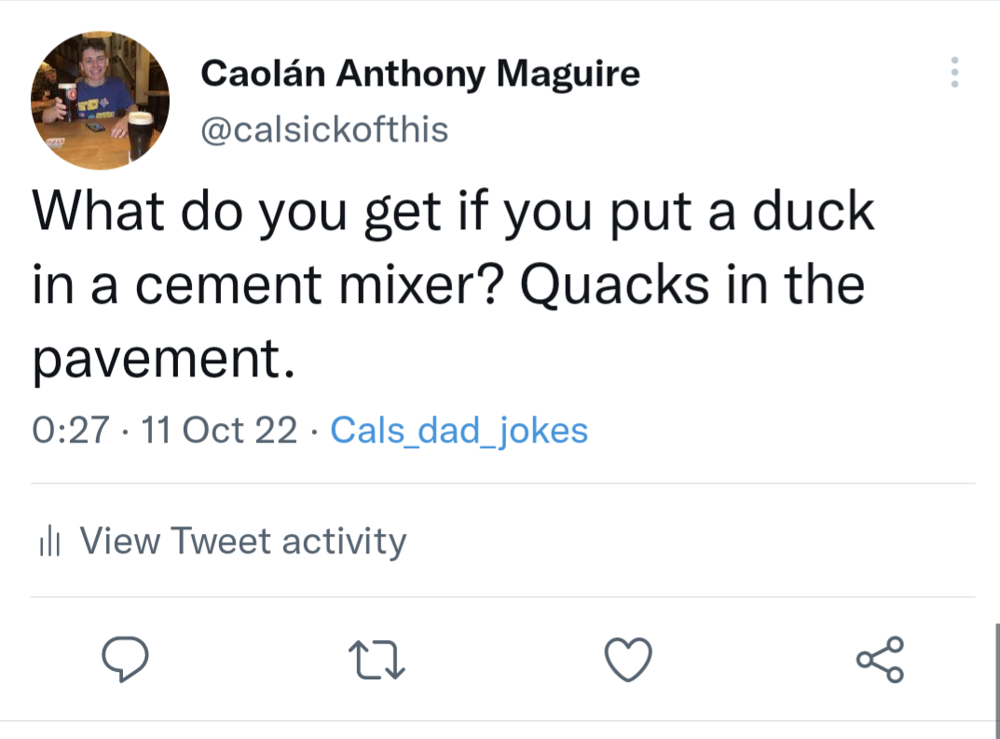

<iframe src="https://giphy.com/embed/1woSafF6fSRUa40iTr" width="480" height="268" frameBorder="0" class="giphy-embed" allowFullScreen></iframe>
<a href="https://giphy.com/gifs/wheezywaiter-1woSafF6fSRUa40iTr">via GIPHY</a>

# Dad jokes twitter bot

For this project I had a free evening and wanted to learn how to use Twitter's API to automate tweets. I found a useful libarary that queries numerous apis and returns a string with a funny joke in it - this project only took me an evening so I haven't added much functionality to it although I may come back to add to it as I have different uses for Twitter's API 

# This program in action : 

# How to run
